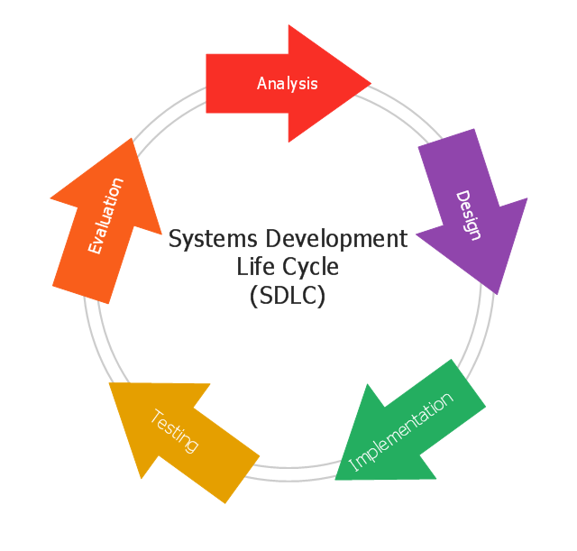

# Portfolio S3
In dit portfolio licht ik mijn werk per leerdoel toe. Het gaat hierbij om zowel de IP-leerdoelen als GP-leerdoelen.

## Webapplicatie

**Front-end**

Voor de front-end word gebruik gemaakt van React. Aangezien React het meest gebruikte Javascript framework is en er veel ondersteuning en informatie over is te vinden.
Ik had voor dit semester nog geen kennis van React, maar wel van VueJS. Aangezien er veel gelijkenissen zijn, ben ik in React begonnen aan de hand van de [uitgebreide documentatie](https://reactjs.org/docs/getting-started.html).

**Back-end**

De back-end word geschreven in Java i.c.m. het Spring Boot framework om een REST-API te ontwikkelen. Dit omdat ik al ervaring heb met C# en graag een nieuwe taal wil leren.
Er is gekozen voor Spring Boot omdat het er voor zorgt dat je geen server nodig hebt, maar de applicatie lokaal kan draaien. Ook kan je de applicatie snel configureren. Daarnaast biedt het verschillende ORMs voor databases.

Omdat Java onder de knie te krijgen heb ik eerst een [cursus](https://www.codecademy.com/learn/learn-java) op CodeCademy gevolgd. Dit hielp om de verschillen tussen C# en Java te leren.

De applicatie die ik gemaakt heb is een platform / marktplaats voor mensen om klussen op te plaatsen.
Een ondernemer kan deze klus vervolgens inzien en ook oppakken om uit te voeren. Hierbij kan de ondernemer een prijs en datum aanbieden.
De gebruiker die een ondernemer zoekt om de klus uit te voeren, kan in zijn account zijn aangemaakte klussen inzien.

To do: **insert component en code diagram**

#### C4: context diagram

#### C4: container diagram

[Front-end repository
](https://github.com/rubyfeller/s3-ip-frontend)

[Back-end repository
](https://github.com/rubyfeller/s3-ip-restapi)

**Database**

Voor de database is SQL gebruikt in combinatie met MySQL.
Dit omdat de database veel relaties zal gaan bevatten, en van te voren bekend is welke data er in komt.
Daarnaast word gebruik gemaakt van de ORM Hibernate.

## Software quality
Voor het toepassen van Version Control heb ik gebruik gemaakt van GitHub.
Daarnaast word gebruik gemaakt van verschillende branches: een main/master branch en een development branch.
Zo kan er eerst een pull request gemaakt worden voordat de wijzigingen toegepast worden.

Voor het bewaken van de kwaliteit van de software heb ik gebruik gemaakt van SonarCloud. Deze tool maakt scans van de code, en laat op basis hiervan zien of er verbeteringen mogelijk zijn, of dat er bugs of kwetsbaarheden in de code zitten.

To do: **toevoegen wat gedaan is met de code smells / security notices.**

Tot slot heb ik onderzoek gedaan naar hoe de kwaliteit in een gedistribueerde webapplicatie gewaarborgd kan worden middels testen.

[Onderzoek testen
](https://github.com/rubyfeller/s3-portfolio/blob/main/portfolio/research/Onderzoek%20testen.docx)
## Agile
In de proftaak is gebruik gemaakt van de agile werkmethode SCRUM. Hierbij hebben we als groep daily standups gehouden, 5 sprint opleveringen gehad en een aantal refinment sessies met de product owners gehad. Hierbij is gebruik gemaakt van Azure DevOps om de voorgang bij te houden en te communiceren.
Ook is er een burndownchart gemaakt.

Voor de retrospective hebben we gebruik gemaakt van de [4ls](https://www.atlassian.com/team-playbook/plays/4-ls-retrospective-technique) methode:

### Andere agile ontwikkelmethodes
Andere agile ontwikkelmethods zijn onder andere kanban, extreme programming en lean development. Bij kanban ligt de focus op efficiency en op het verminderen van de duur van een project.
Er zijn hierbij geen vastgezette sprints, maar het werk word continu voorgezet. Ook zijn er geen rollen als product owners en scrum masters of vaste meetings (daily standups, refinements etc).

Extreme programming (XP), lijkt meer op SCRUM. Er word hierbij wel gekozen voor kortere iteraties van tussen de 1 en 3 weken.
Er word gekeken wat in de iteratie mogelijk is en iedere ontwikkelaar geeft aan wat hij kan doen. De klant prioriteert de user stories.
Daarnaast gaan de ontwikkelaars pair-programmeren, ook worden er iedere iteratie tests geschreven voordat de code op productie gaat.

Tot slot een vergelijking met lean development. Hier geldt, net zoals bij kanban, dat er geen vaste iteraties/sprints worden afgesproken.
Er word dus continu doorontwikkeld. De lean methode komt voort uit de industriewereld, met als doel om processen binnen een bedrijf effieciënter te maken. Dit is dus anders dan bij Scrum, welke alleen ingezet word in kleine teams.

### Andere ontwikkelmethodes
De meest bekende alternatieve ontwikkelmethode voor agile is waterval.
De watervalmethode is een linear proces waarin van tevoren alle requirements worden opgesteld. Het volgt de Software Development Life Cycle (SDLC).
Vaak is er in deze methode ook sprake van een contract welke van tevoren getekend word en niet meer gewijzigd kan worden.

In onderstaande afbeelding is te zien hoe de SDLC in de waterval-methode eruit ziet:

Iedere stap die is weergegeven: analyse, design, implementatie, testen en evaluatie worden los van elkaar uitgevoerd. De volgende stap kan niet starten voordat de voorgaande afgerond en gereviewd is.
Er word dus bijvoorbeeld niet zoals bij Scrum iedere sprint getest, maar pas als alle voorgaande processen zijn afgerond (analyse tot en met implementatie).

Dit ontwikkelproces word voornamelijk gebruikt als er weinig veranderingen verwacht worden.

To do: **Insert screenshot burndown chart**

## CI/CD
Aan de repositories op GitHub heb ik 'Github Actions' toegevoegd: een tool om CI/CD toe te passen.
De CI/CD workflow zorgt er als eerst voor dat er een build van de applicatie gemaakt word. Daarnaast worden alle testen uitgevoerd.
Op basis van het resultaat van de eerste actie, word een Docker image aangemaakt. In de laatste stap word deze image gepushet naar GitHub Packages, welke gekoppeld is aan de correcte repository.

Daarnaast word SonarCloud getriggered om een code scan te maken. Op basis hiervan kan de code verbeterd worden.

[GitHub workflow front-end
](https://github.com/rubyfeller/s3-ip-frontend/blob/main/.github/workflows/node.js.yml)

[GitHub workflow back-end
](https://github.com/rubyfeller/s3-ip-restapi/blob/master/.github/workflows/maven.yml)

[Dockerfile front-end
](https://github.com/rubyfeller/s3-ip-frontend/blob/main/Dockerfile)

[Dockerfile back-end
](https://github.com/rubyfeller/s3-ip-restapi/blob/master/Dockerfile)

[GitHub Package front-end
](https://github.com/rubyfeller/s3-ip-frontend/pkgs/container/s3-ip-frontend)

[GitHub Package back-end
](https://github.com/rubyfeller/s3-ip-restapi)

In het groepsproject heb ik gebruik gemaakt van Azure Pipelines, waar een Docker image gemaakt en gepushet word naar AWS ECR. Vanuit daar word een ECS instance aangemaakt, welke ervoor zorgt dat de applicatie draait op een EC2 server.
In onderstaande afbeelding is de architectuurdiagram van het groepsproject te zien, met daarin het CI/CD proces:

## Cultural differences and ethics

## Requirements and design
Voor het opstellen van requirements heb ik gebruik gemaakt van user stories in combinatie met acceptatiecriteria / definition of done.
Deze zijn per sprint bijgehouden in Jira:

## Business processes

## Professional

To do: **Insert FeedPulse screenshot / export**

In het groepsproject hebben we elkaar aan het einde van de sprint peer feedback gegeven:

## Reflectie
To do: **reflectie op dit semester.**