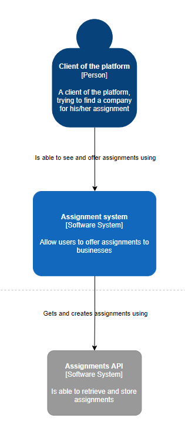
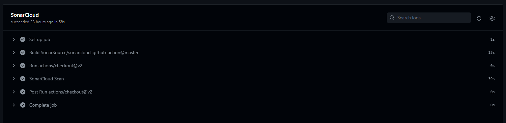
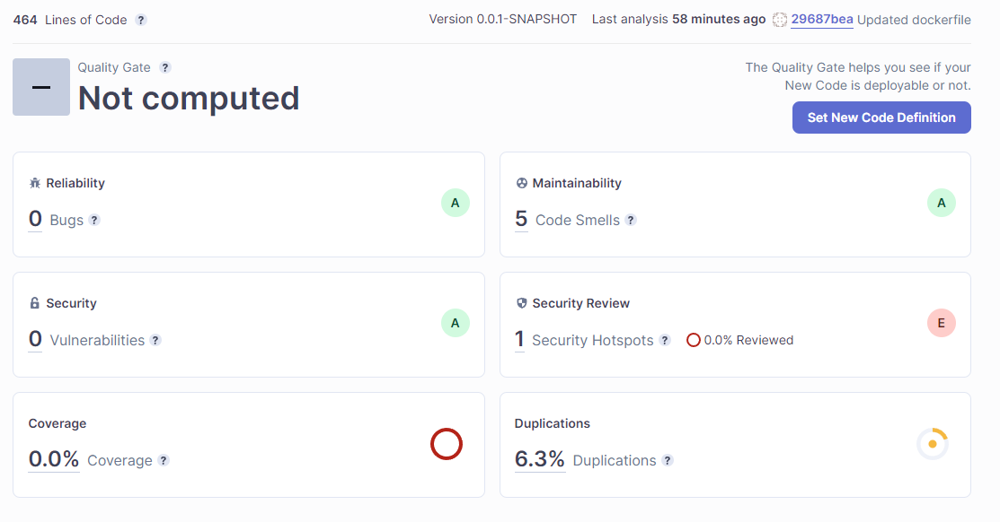
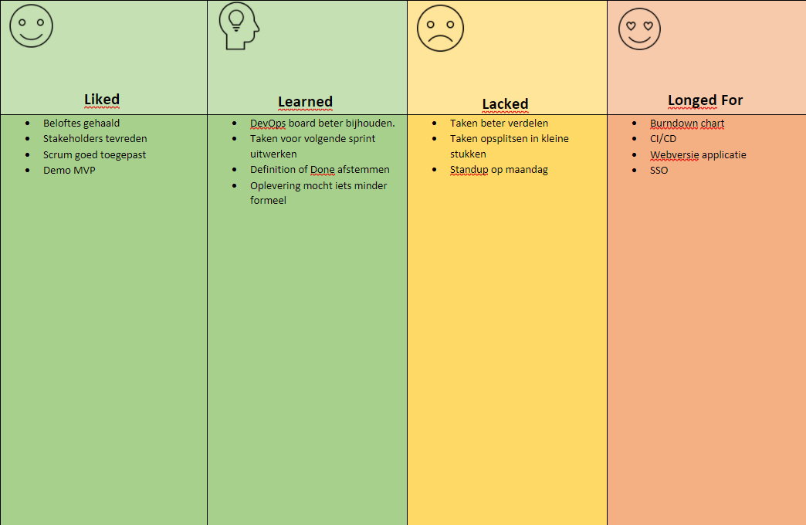
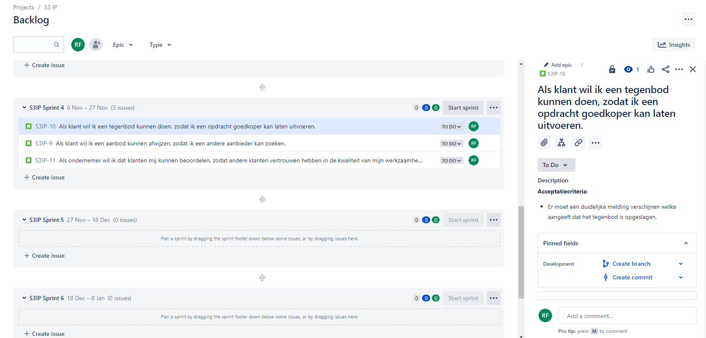
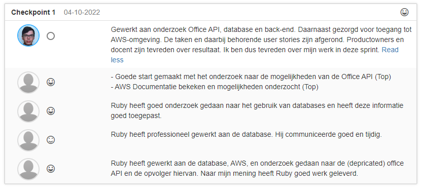

# Portfolio S3
In dit portfolio licht ik mijn werk per leerdoel toe. Het gaat hierbij om zowel de IP-leerdoelen als GP-leerdoelen.

## Webapplicatie
**Front-end**

Voor de front-end word gebruik gemaakt van React. Aangezien React het meest gebruikte Javascript framework is en er veel ondersteuning en informatie over is te vinden.

**Back-end**

De back-end word geschreven in Java i.c.m. het Spring Boot framework om een REST-API te ontwikkelen. Dit omdat ik al ervaring heb met C# en graag een nieuwe taal wil leren.
Er is gekozen voor Spring Boot omdat het er voor zorgt dat je geen server nodig hebt, maar de applicatie lokaal kan draaien. Ook kan je de applicatie snel configureren. Daarnaast biedt het verschillende ORMs voor databases.

**Insert component en code diagram**

#### C4: context diagram

#### C4: container diagram

[Front-end repository
](https://github.com/rubyfeller/s3-ip-frontend)

[Back-end repository
](https://github.com/rubyfeller/s3-ip-restapi)

**Database**

Voor de database is SQL gebruikt in combinatie met MySQL.
Dit omdat de database veel relaties zal gaan bevatten, en van te voren bekend is welke data er in komt.
Daarnaast word gebruik gemaakt van de ORM Hibernate.

## Software quality
Voor het toepassen van Version Control heb ik gebruik gemaakt van GitHub.
Daarnaast word gebruik gemaakt van verschillende branches: een main/master branch en een development branch.
Zo kan er eerst een pull request gemaakt worden voordat de wijzigingen toegepast worden.

Voor het bewaken van de kwaliteit van de software heb ik gebruik gemaakt van SonarCloud. Deze tool maakt scans van de code, en laat op basis hiervan zien of er verbeteringen mogelijk zijn, of dat er bugs of kwetsbaarheden in de code zitten.

## Agile
In de proftaak is gebruik gemaakt van de agile werkmethode SCRUM. Hierbij hebben we als groep daily standups gehouden, 5 sprint opleveringen gehad en een aantal refinment sessies met de product owners gehad. Hierbij is gebruik gemaakt van Azure DevOps om de voorgang bij te houden en te communiceren.
Ook is er een burndownchart gemaakt.

Voor de retrospective hebben we gebruik gemaakt van de [4ls](https://www.atlassian.com/team-playbook/plays/4-ls-retrospective-technique) methode:

**Insert screenshot board/burndown**

## CI/CD
Aan de repositories op GitHub heb ik 'Github Actions' toegevoegd: een tool om CI/CD toe te passen.
De CI/CD workflow zorgt er als eerst voor dat er een build van de applicatie gemaakt word. Daarnaast worden alle testen uitgevoerd.
Op basis van het resultaat van de eerste actie, word een Docker image aangemaakt. In de laatste stap word deze image gepushet naar GitHub Packages, welke gekoppeld is aan de correcte repository.

Daarnaast word SonarCloud getriggered om een code scan te maken. Op basis hiervan kan de code verbeterd worden.

[GitHub workflow front-end
](https://github.com/rubyfeller/s3-ip-frontend/blob/main/.github/workflows/node.js.yml)

[GitHub workflow back-end
](https://github.com/rubyfeller/s3-ip-restapi/blob/master/.github/workflows/maven.yml)

[Dockerfile front-end
](https://github.com/rubyfeller/s3-ip-frontend/blob/main/Dockerfile)

[Dockerfile back-end
](https://github.com/rubyfeller/s3-ip-restapi/blob/master/Dockerfile)

[GitHub Package front-end
](https://github.com/rubyfeller/s3-ip-frontend/pkgs/container/s3-ip-frontend)

[GitHub Package back-end
](https://github.com/rubyfeller/s3-ip-restapi)

In het groepsproject heb ik gebruik gemaakt van Azure Pipelines, waar een Docker image gemaakt en gepushet word naar AWS ECR. Vanuit daar word een ECS instance aangemaakt, welke ervoor zorgt dat de applicatie draait op een EC2 server.

## Cultural differences and ethics

## Requirements and design
Voor het opstellen van requirements heb ik gebruik gemaakt van user stories in combinatie met acceptatiecriteria / definition of done.
Deze zijn per sprint bijgehouden in Jira:

**Insert screenshot**

## Business processes

## Professional

**Insert FeedPulse screenshot / export**

In het groepsproject hebben we elkaar aan het einde van de sprint peer feedback gegeven:

## Reflectie
Reflectie op dit semester.