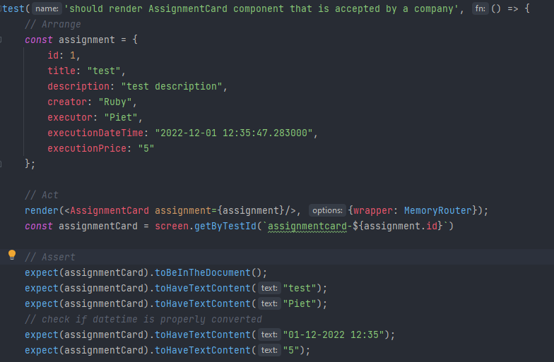

# Portfolio S3
In dit portfolio licht ik mijn werk per leerdoel toe. Het gaat hierbij om zowel de IP-leerdoelen als GP-leerdoelen.

## Webapplicatie
****Omschrijving IP****

De applicatie die ik gemaakt heb, is een platform / marktplaats voor mensen om klussen op te plaatsen.
Een ondernemer kan deze klus vervolgens inzien en ook oppakken om uit te voeren. Hierbij kan de ondernemer een prijs en datum aanbieden.
De gebruiker die een ondernemer zoekt om de klus uit te voeren, kan in zijn account zijn aangemaakte klussen inzien.

****Omschrijving GP****

Voor het groepsproject hebben we een app gemaakt die het mogelijk maakt om collega's gemakkelijk te kunnen vinden. Dus bijvoorbeeld of ze thuiswerken, op kantoor of bijvoorbeeld niet aan het werk zijn.
Ook is te zien waar de collega dan aan het werk is. Het doel is dat medewerkers elkaar gemakkelijker kunnen vinden, het probleem dat het bedrijf heeft is dat mensen veel tijd kwijt zijn aan het vinden van elkaar.

#### C4: context diagram

Uit feedback bleek dat de API (grijs blok), niet gezien kan worden als extern systeem omdat het bij de applicatie hoort. Dit maakt de contextdiagram minder relevant. Ik heb hem toch laten staan omdat ik er wel wat van geleerd heb.

#### C4: container diagram

[Front-end repository
](https://github.com/rubyfeller/s3-ip-frontend)

[Back-end repository
](https://github.com/rubyfeller/s3-ip-restapi)

### Front-end

Voor de front-end word gebruik gemaakt van React. Aangezien React het meest gebruikte Javascript framework is en er veel ondersteuning en informatie over is te vinden.
Ik had voor dit semester nog geen kennis van React, maar wel van VueJS. Aangezien er veel gelijkenissen zijn, ben ik in React begonnen aan de hand van de [uitgebreide documentatie](https://reactjs.org/docs/getting-started.html).
Toch bleken er ook veel verschillen te zijn tussen Vue en React, onder andere op het gebied van functies, hooks en components.

#### Architectuur

Aangezien React erg open is en je iedere architectuur kunt kiezen, was het lastig om op te starten. 
Uiteindelijk heb ik wel een handige manier van werken gevonden:

***Features***

Zoals in bovenstaande afbeelding is te zien, staan sommige mappen er dubbel in. Dit komt doordat ik met 'features' werk: in iedere feature maak ik dezelfde submappen components, hooks en services.
Ook heb ik deze zelfde mappen globaal aangemaakt. Wanneer er een hook, component of service is die in meerdere features gebruikt kan worden, plaats ik deze in de globale map. Wanneer een van deze 3 maar in 1 feature gebruikt word, plaats ik deze bij de juiste feature.

Dit voorkomt het probleem dat ik bij de start had: alle bestanden onder elkaar zonder structuur. Daarnaast kan ik de components en hooks gemakkelijk in 1 bestand exporteren. 
Dit zorgt ervoor dat ik in andere bestanden niet vanuit verschillende locaties hoef te importeren, maar slechts vanuit 1 index file uit de root van de feature map.

***Layouts, libs en pages***

Gezien er een aantal UI-onderdelen zijn welke op meerdere pagina's gebruikt worden, heb ik deze in de map 'layouts' geplaatst. Denk aan alerts en de nabar.

In de map library plaats ik functies die een library gebruiken en op meerdere plekken gebruikt worden. Dit heet het facade pattern en zorg ervoor dat ik niet in iedere hook/functie opnieuw een Axios functie hoef aan te maken. Mocht bijvoorbeeld de URL van de API wijzigen, hoef ik dit maar op 1 plek aan te passen.
De map pages bevat alle pagina's van de applicatie. Indien de applicatie groter zou worden, zou ik deze ook nog kunnen onderverdelen in features.

De front-end tests heb ik bij het geteste onderdeel geplaatst. Zo staat de test van de AssignmentCard ook bij dit component. Zie [Requirements and design](https://github.com/rubyfeller/s3-portfolio/blob/main/portfolio/portfolio.md#requirements-and-design).

***Router en Auth0 implementatie***

Voor het verbinden van het juiste path aan de juiste pagina, heb ik [React Router](https://reactrouter.com/en/main) gebruikt. Ook heb ik in deze router de endpoints beschermd, met gebruik van een custom hook van Auth0. Dit zorgt ervoor dat je als gebruiker naar de login pagina gestuurd word indien je niet ingelogd bent.

### Back-end

De back-end word geschreven in Java i.c.m. het Spring Boot framework om een REST-API te ontwikkelen. Dit omdat ik al ervaring heb met C# en graag een nieuwe taal wil leren.
Er is gekozen voor Spring Boot omdat het er voor zorgt dat je geen server nodig hebt, maar de applicatie lokaal kan draaien. Ook kan je de applicatie snel configureren. Daarnaast biedt het verschillende ORMs voor databases.

Om Java onder de knie te krijgen heb ik eerst een [cursus](https://www.codecademy.com/learn/learn-java) op CodeCademy gevolgd. Dit hielp om de verschillen tussen C# en Java te leren.

#### Architectuur

Voor de back-end heb ik gekozen voor het repository pattern. Het doel van dit design pattern is het maken van een scheiding tussen de business logic en data access layer. Hierdoor is het mogelijk om gemakkelijk een ander databasesysteem te gebruiken.

De verschillende lagen (Java packages) zijn:

- Controller laag, deze heb ik presentation genoemd

De controller bevat alle API-endpoints en roept methods in de service class aan (via een interface). Gebruikt geen Hibernate models, maar DTO's.

- Service layer, deze heb ik logic genoemd

Deze laag bevat de business logic en roept de converters en repositories (dals) aan.

- Repository layer, deze heb ik dal genoemd.

Bevat alle Hibernate-models en de repositories. 

De overige packages/lagen zijn config om CORS in te stellen, converter waarin ik gebruik maak van de package ModelMapper om DTO's om te zetten naar entiteiten en vice versa. In de DTO-laag staan alle DTO's, dit voorkomt dat de presentatie-laag de logica-laag direct gebruikt.  Daarnaast is er een security laag waarin ik voornamelijk de endpoints bescherm middels Spring Security (i.c.m. Auth0).

In de toekomst zou ik de naamgeving van de lagen wellicht anders aanpakken. Alhoewel er geen standaarden zijn, gebruik in namen die over het algemeen minder gebruikt worden. Dit heb ik in het begin zo aangepakt zodat helder was welke laag waarvoor verantwoordelijk is.

***OpenAPI documentatie***

Gedurende het testen van de Rest-API heb ik gebruik gemaakt van Postman. Hierin dient echter alles handmatig toegevoegd te worden.
Aangezien er ook een open-source standaard bestaat, OpenAPI, heb ik deze gebruikt voor de documentatie. Naast dat het een standaard is, waardoor ontwikkelaars de documentatie gemakkelijk kunnen begrijpen, is het ook mogelijk om de documentatie automatisch te laten maken.
Dit heb ik gedaan door het gebruik van een implementatie op OpenAPI: Swagger. Dit in combinatie met [Spring Doc](https://springdoc.org/) maakte het erg gemakkelijk.

Naast de UI is de documentatie ook te vinden in JSON-formaat via de endpoint v3/api-docs.

Om het inzien van de documentatie mogelijk te kunnen maken, heb ik de URLs van Swagger en OpenAPI wel een vrijstelling moeten geven in Spring Security. Ook heb ik de toegang van de documentatie op productie uitgezet.

**Database**

Voor de database is SQL gebruikt in combinatie met MySQL.
Dit omdat de database veel relaties zal gaan bevatten, en van tevoren bekend is welke data er in komt.
Daarnaast word gebruik gemaakt van de ORM Hibernate.

## Software quality
Voor het toepassen van Version Control heb ik gebruik gemaakt van GitHub.
Daarnaast word gebruik gemaakt van verschillende branches: een main/master branch en een development branch.
Zo kan er eerst een pull request gemaakt worden voordat de wijzigingen toegepast worden.

Voor het bewaken van de kwaliteit van de software heb ik gebruik gemaakt van SonarCloud. Deze tool maakt scans van de code, en laat op basis hiervan zien of er verbeteringen mogelijk zijn, of dat er bugs of kwetsbaarheden in de code zitten.

In onderstaande afbeelding is een van de code smells te zien:

Ook staat er een toelichting bij over waarom dit een probleem is: "When verifying that code raises a runtime exception, a good practice is to avoid having multiple method calls inside the tested code, to be explicit about which method call is expected to raise the exception.

It increases the clarity of the test, and avoid incorrect testing when another method is actually raising the exception."

Hierom heb ik de code aangepast zodat er maar 1 exception op 1 method call mogelijk is.

Ook hadden veel code smells te maken met code die in minder regels geschreven kon worden, ook dit heb ik toegepast. Daarnaast hadden de meeste code smells betrekking op code die uitgecomment is.
Aangezien ik gebruik maak van versiebeheer heb ik besloten om geen stukken code gecomment in mijn code te laten staan.

Tot slot waren er ook enkele code smells waar ik niets mee gedaan heb. Zo gebruik ik af en toe dezelfde tekst in een exception test. Aangezien het hier om tests gaat, waar alle tests in principe los van elkaar moeten staan, heb ik besloten hier niets mee te doen.

****Security notices****

Gedurende het ontwikkelen van de applicatie zijn ook security notices naar boven gekomen:

Zoals in de afbeelding is te zien, word op dit moment ieder soort HTTP-request naar de applicatie toegestaan. Dit is niet veilig en dient aangepast te worden wanneer de applicatie naar productie gaat. SonarCloud zorgt er voor dat je dit niet vergeet.

#### Onderzoek 1
Ook heb ik onderzoek gedaan naar hoe de kwaliteit in een gedistribueerde webapplicatie gewaarborgd kan worden middels testen. Hiervoor heb ik gebruik gemaakt van het [DOT-framework](https://ictresearchmethods.nl/The_DOT_Framework).

[Onderzoek testen
](https://github.com/rubyfeller/s3-portfolio/blob/main/portfolio/research/Onderzoek%20testen.pdf)

Aan de hand van dit onderzoek heb ik mijn applicatie getest. Aangezien het in een gedistribueerde webapplicatie belangrijk is dat diverse modules/onderdelen met elkaar kunnen communiceren, heb ik gekozen voor integratietests.
Om te valideren dat de applicatie voldoet aan de eisen heb ik tevens gebruik gemaakt van acceptatietests, in de vorm van endpoint-tests.

Deze tests heb ik toegepast met gebruik van Spring Boot Test, JUnit en TestContainers. TestContainers zorg voor een Docker image, met daarop de database.
Hiervoor heb ik gekozen omdat het mocken van de data minder waardevol is, en de daadwerkelijke database gebruiken de database onnodig vult. 
In de TestContainer wordt dezelfde versie van MySQL gedraaid als in de daadwerkelijke applicatie, zodat eventuele fouten met betrekking tot MySQL ook aan het licht komen.
In onderstaande afbeelding is 1 van de integratietests zichtbaar:

Ik test hier of de assignment wordt toegevoegd, of de velden correct zijn, en of deze correct in de database komt.

In onderstaande afbeelding is een voorbeeld van een acceptatietest te zien. Hierbij word de controller getest, voornamelijk om te controleren of het resultaat en de HTTP statuscode uit het endpoint correct is:

Zie voor front-end testen [Requirements and design](https://github.com/rubyfeller/s3-portfolio/blob/main/portfolio/portfolio.md#requirements-and-design).

#### Onderzoek 2
Tot slot heb ik een onderzoek gedaan naar waar je het beste een JWT op kunt slaan.

[Security onderzoek opslaan JWTs
](https://github.com/rubyfeller/s3-portfolio/blob/main/portfolio/research/Onderzoek%20security.md#is-mijn-applicatie-kwetsbaar-voor-een-van-de-aanvallen)

## Agile
### Wat houdt Agile in?
Agile is een benadering voor het ontwikkelen van software. De focus ligt op het behalen van resultaten in iteraties van 1 tot 4 weken.
Het doel is om flexibel om te gaan met feedback: iedere iteratie kunnen klanten hun eisen aanpassen. Dit zorgt ervoor dat de feedback van de klant direct wordt meegenomen in de Systems Development Life Cycle (SDLC).

### Agile Manifesto

Het Agile Manifesto is een reeks van principes voor het ontwikkelen van software. Het manifest is opgesteld door een groep softwareontwikkelaars. Het manifest kent 4 kernwaarden:
- Personen en interacties zijn belangrijker dan processen en tools

Dit principe betekend dat de focus is op de leden van het team in plaats van op tools en documentatie. Dit komt o.a. terug in de retrospective en planning.

- Werkende software is belangrijker dan uitgebreide documentatie

In plaats van een uitgebreide analyse, moet de focus op het product liggen. Er word uiteraard nog steeds documentatie geschreven, echter alleen het minimum dat nodig is voor de ontwikkeling van het product.

- Actieve rol voor de klant is beter dan het uitonderhandelen van een contract

Dit principe is opgesteld omdat klanten er vaak tijdens de ontwikkeling pas achter komen wat ze daadwerkelijk willen.
De flexibiliteit en continue feedback zorgt er voor dat het eindproduct beter is, en niet teleurstellend is op basis van een vooraf opgestelde omschrijving.

- Reageren op verandering is beter dan het volgen van een vooraf bedacht plan.

Dit principe geeft aan dat iets nooit perfect is en het product continue verbeterd word op basis van feedback in de opleveringen.

Bronnen:

Agile Manifesto: https://agilemanifesto.org/

Codeproject: https://www.codeproject.com/Articles/704720/Scrum-explained

In de proftaak is gebruik gemaakt van de agile ontwikkelmethode Scrum. Hier hebben we voor gekozen vanwege de flexibiliteit in de ontwikkeling en betrokkenheid van de klant. We zijn ervan overtuigd dat dit zorgt voor een beter eindproduct, omdat de klant goed op de hoogte is en feedback of nieuwe inzichten kan delen.

Hierbij hebben we als groep daily standups en planningmeetings gehouden, 5 sprint opleveringen gehad en een aantal refinement sessies met de product owners gehad. Hierbij is gebruik gemaakt van Azure DevOps om de voorgang bij te houden en te communiceren.
Ook is er een burndownchart gemaakt.

Voor de retrospective hebben we gebruik gemaakt van de [4ls](https://www.atlassian.com/team-playbook/plays/4-ls-retrospective-technique) methode:

Op basis van deze methode konden we direct zien wat er goed ging, wat we hebben geleerd, wat we miste, en wat we de volgende keer beter kunnen doen.

### Andere agile ontwikkelmethodes
Andere agile ontwikkelmethodes zijn onder andere kanban, extreme programming en lean development. Bij kanban ligt de focus op efficiency en op het verminderen van de duur van een project.
Er zijn hierbij geen vastgezette sprints, maar het werk word continu voorgezet. Ook zijn er geen rollen als product owners en scrum masters of vaste meetings (daily standups, refinements etc).

Extreme programming (XP), lijkt meer op SCRUM. Er word hierbij wel gekozen voor kortere iteraties van tussen de 1 en 3 weken.
Er word gekeken wat in de iteratie mogelijk is en iedere ontwikkelaar geeft aan wat hij kan doen. De klant prioriteert de user stories.
Daarnaast gaan de ontwikkelaars pair-programmeren, ook worden er iedere iteratie tests geschreven voordat de code op productie gaat.

Tot slot een vergelijking met lean development. Hier geldt, net zoals bij kanban, dat er geen vaste iteraties/sprints worden afgesproken.
Er word dus continu doorontwikkeld. De lean methode komt voort uit de industriewereld, met als doel om processen binnen een bedrijf efficiënter te maken. Dit is dus anders dan bij Scrum, welke alleen ingezet word in kleine teams.

### Andere ontwikkelmethodes
De meest bekende alternatieve ontwikkelmethode voor agile is waterval.
De watervalmethode is een linear proces waarin van tevoren alle requirements worden opgesteld. Het volgt de Software Development Life Cycle (SDLC).
Vaak is er in deze methode ook sprake van een contract welke van tevoren getekend word en niet meer gewijzigd kan worden.

In onderstaande afbeelding is te zien hoe de SDLC in de waterval-methode eruit ziet:

Iedere stap die is weergegeven: analyse, design, implementatie, testen en evaluatie worden los van elkaar uitgevoerd. De volgende stap kan niet starten voordat de voorgaande afgerond en gereviewd is.
Er word dus bijvoorbeeld niet zoals bij Scrum iedere sprint getest, maar pas als alle voorgaande processen zijn afgerond (analyse tot en met implementatie).

Dit ontwikkelproces word voornamelijk gebruikt als er weinig veranderingen verwacht worden.

Bronnen: 

Coscreen: https://www.coscreen.co/blog/extreme-programming-vs-scrum-difference/

Atlassian: https://www.atlassian.com/agile/kanban/kanban-vs-scrum

Visual Paradigm: https://www.visual-paradigm.com/scrum/scrum-vs-waterfall-vs-agile-vs-lean-vs-kanban/

**Azure DevOps (Scrum)board:**

In Azure Devops hebben we de sprints gepland, user stories en taken toegevoegd. Daarnaast gebruiken we op advisering van de product owners de geïntegreerde Git functionaliteit voor onze repo's. Ook gebruiken we de DevOps Pipelines voor onze CI/CD. 

Bij de eerste sprints van het project kwamen we er achter dat de taken te algemeen beschreven werden. Ook werkte er meerdere mensen aan 1 taak. Uiteindelijk hebben we dit veranderd door kleinere taken te maken, zodat ieder lid een taak kan oppakken.
Ook hebben we de taken beter geformuleerd en op advies van de productowners een Definition of Done toegevoegd, zodat er geen discussie kan ontstaan over wanneer een taak af is:

De burndownchart word in Azure DevOps automatisch gegenereerd. We hebben hier naar gekeken om gemakkelijk te kunnen zien of we op schema liepen.

Zoals in de bovenstaande burndown chart te zien is, hebben we in de loop van de sprint nog veel extra taken toegevoegd. Hierdoor gaat de burndown in het begin voornamelijk omhoog.
Later hebben we taken afgerond en begint de burndown langzaam te dalen. Echter is de ideal trend aan het einde 0, en de daadwerlijke openstaande taken 9. Dit betekend dat we niet alles wat we gehoopt hadden af konden maken. Dit ging wel voornamelijk over afrondende taken.

## CI/CD
Aan de repositories op GitHub heb ik 'Github Actions' toegevoegd: een tool om CI/CD toe te passen.
De CI/CD workflow zorgt er als eerst voor dat er een build van de applicatie gemaakt word. Daarnaast worden alle testen uitgevoerd.
Op basis van het resultaat van de eerste actie, word een Docker image aangemaakt. In de laatste stap word deze image gepushet naar GitHub Packages, welke gekoppeld is aan de correcte repository.

Daarnaast word SonarCloud getriggered om een code scan te maken. Op basis hiervan kan de code verbeterd worden.

[GitHub workflow front-end
](https://github.com/rubyfeller/s3-ip-frontend/blob/main/.github/workflows/node.js.yml)

[GitHub workflow back-end
](https://github.com/rubyfeller/s3-ip-restapi/blob/master/.github/workflows/maven.yml)

[Dockerfile front-end
](https://github.com/rubyfeller/s3-ip-frontend/blob/main/Dockerfile)

[Dockerfile back-end
](https://github.com/rubyfeller/s3-ip-restapi/blob/master/Dockerfile)

[GitHub Package front-end
](https://github.com/rubyfeller/s3-ip-frontend/pkgs/container/s3-ip-frontend)

[GitHub Package back-end
](https://github.com/rubyfeller/s3-ip-restapi)

Ter informatie voor mensen die wellicht met de applicatie aan de slag willen heb ik deployment instructies geschreven voor zowel de [front-end](https://github.com/rubyfeller/s3-ip-frontend#deployment-instructions-docker) als de [back-end](https://github.com/rubyfeller/s3-ip-restapi#deployment-instructions).

**Overzicht containers:**

**Overzicht images:**

In het groepsproject heb ik gebruik gemaakt van Azure Pipelines, waar een Docker image gemaakt en gepushet word naar AWS ECR. Vanuit daar word een ECS instance aangemaakt, welke ervoor zorgt dat de applicatie draait op een EC2 server.
In onderstaande afbeelding is de architectuurdiagram van het groepsproject te zien, met daarin het CI/CD proces:

## Cultural differences and ethics

### Wat is cultuur?
Cultuur omschrijft de gewoontes, normen en waarden van een samenleving. Het kan verschillende groepen mensen van elkaar onderscheiden, en word overgedragen van generatie op generatie.

Ik heb gekeken naar mijn interculturele competenties door een assessment van IDI (Intercultural Development Inventory) te maken.
Ook heb ik gekeken naar de uitkomsten hiervan middels een debriefing en quiz. 

Uit het assessment kwam naar voren dat ik mijn vaardigheden met betrekking tot het aanpassen en begrijpen van culturele verschillen erg heb overschat.

In onderstaande afbeelding is de score te zien waarop ik mezelf had ingeschat (perceived):

Deze score valt binnen het oriëntatieprofiel 'minimization': dit weerspiegelt een tendens om de nadruk te leggen op overeenkomsten tussen culturen, maar waarbij belangrijke verschillen in waarden, waarneming en gedrag over het hoofd gezien kunnen worden.

In onderstaande afbeelding is mijn werkelijke score (developmental) te zien: 

Deze score geeft aan dat ik te kritisch ben op mijn eigen cultuur (Reversal), en ik minder kritisch ben op andere culturen.
Hier kan ik mijzelf in herkennen, aangezien ik mijn eigen cultuur uiteraard het best ken en hier dus ook de nadelen van zie. Deze blijk ik echter teveel uit te vergroten.

In onderstaande afbeelding zijn de positieve kanten van het profiel polarisatie te zien, en de kansen die er nog liggen:

Ik ben van plan om meer te kijken naar overeenkomsten tussen mijn eigen cultuur en andere culturen, en om niet te kritisch te zijn op mijn eigen cultuur.
Ook hoop ik hiermee in te gaan zien dat iedere cultuur een mix van positieve en negatieve kanten heeft.

### In kaart brengen van culturele verschillen
Om culturele verschillen tussen landen in kaart te brengen, heb ik gekeken naar het cultuurmodel van Geert Hofstede.
Dit cultuurmodel laat de verschillen tussen landen en culturen zien aan de hand van 6 dimensies. Dit maakt het mogelijk om de culturen te vergelijken.

Onderstaand de belangrijkste dimensies:
- Machtsafstand

Geeft aan in hoeverre hiërarchie een belangrijke rol speelt in een land. Nederland scoort erg laag op deze dimensie. Dit betekend dat leidinggevenden bijvoorbeeld toeganlijk zijn en informeel aangesproken kunnen worden. De communicatie is direct.
In andere landen zoals Maleisië is de werkcultuur veel hiërarchischer: mensen verwachten dat hen verteld word wat ze moeten doen, en het doel is om een baan te krijgen waarin ze zelf kunnen bepalen wat anderen moeten doen.

- Individualisme

Geeft aan hoe individualistisch of hoe collectivistisch een land is. Nederland scoort hier erg hoog: men zorgt vooral voor zichzelf en directe familie. Daarnaast worden bijvoorbeeld promoties alleen gegeven op basis van resultaten.
Aziatische culturen zijn collectivistischer: de communicatie is indirect en men vermijdt conflicten. De prioriteit in (zakelijke)relaties ligt niet op taken maar op moraliteit.

- Masculiniteit

Deze dimensie geeft aan in hoeverre er waarde gehecht word aan mannelijke en vrouwelijke kwaliteiten. Landen als Nederland worden als feminiem bestempeld omdat de rolverdeling tussen man en vrouw overlapt. 
In landen als Japan is een duidelijke rolverdeling tussen de man en vrouw.

- Onzekerheidsvermijding

Geeft aan hoe een samenleving omgaat met onzekerheid. Sommige culturen willen zoveel mogelijk onzekerheid vermijden, door bijvoorbeeld het gebruik van rituelen. Ook is geloof er sterker.
Nederland scoort gemiddeld. Mensen hebben wel een lichte voorkeur voor het vermijden van onzekerheid. Dit houdt in dat men zich graag aan regels houd en punctualiteit belangrijk is. Ook is veiligheid erg belangrijk.

Bronnen:

Hofstede Insights: https://www.hofstede-insights.com/country-comparison/the-netherlands/

Wikipedia: https://nl.wikipedia.org/wiki/Geert_Hofstede

Clearly Cultural: https://clearlycultural.com/geert-hofstede-cultural-dimensions/

### Ethiek
****Wat maakt ethiek belangrijk in software engineering?****

Technologie kan veel impact hebben op de samenleving. Daarom is het noodzakelijk om goed te kijken naar de gevolgen en gevaren van de gemaakte technologie.

****ACM Software Engineering Code of Ethics****

De committee on professional ethics (COPE) heeft een code opgesteld voor software engineers. Hiermee willen ze ontwikkelaars helpen om ethisch om te gaan met hun werk.
Ze hebben hiervoor 8 principes opgesteld:

- Public

Software engineers dienen te handelen in het algemeen belang. Neem verantwoordelijkheid voor het gemaakte werk. Ook dienen de mogelijke gevaren voor mensen aan de autoriteiten doorgegeven te worden.

- Client and employer

Wees eerlijk over beperkte ervaring of kennis. Accepteer geen werk dat tegen de belangen van de werkgever ingaat.

- Product

Streef naar hoge kwaliteit, en breng in kaart welke risico's er zijn met betrekking tot ethische kwesties, economische, en klimaat.
Ga respectvol om met privacy in de applicatie en documenten. 

- Judgment

Software engineers moeten onafhankelijk zijn in hun professionele overwegingen. Ook is het niet de bedoeling te werken aan projecten waarin sprake is van belangenverstrengeling.

- Management

Promoot kwaliteit en reduceer risico's. Zorg er voor dat de software engineers op de hoogte zijn de procedures met betrekking tot omgaan met de bescherming van wachtwoorden en bestanden.
Vraag een software engineer niet om iets te doen dat tegenstrijdig is aan deze code.

- Profession

Draag bij aan het creëren van een organisatie die goed omgaat met ethiek. Verspreid kennis over software engineering.
Geef aan wanneer er niet ethisch gehandeld word, tenzij dit niet mogelijk is of gevaarlijk is.

- Colleagues

Spoor collega's aan om de ethische code op te volgen. Ga in op feedback die je krijgt van collega's.

- Self

Blijf jezelf een leven lang ontwikkelen en promoot een ethische aanpak.
Zie in dat het niet volgen van de ethische code niet past bij een professionele software engineer.

#### Etische analyse van applicatie

Om de ethische aspecten van mijn applicatie in kaart te brengen, heb ik gebruik gemaakt van de Technology Impact Cycle Tool (TICT).
De analyse heb ik gemaakt van het groepsproject, aangezien in het individuele project minder ethische aspecten een rol spelen.
Zie [Webapplicatie](https://github.com/rubyfeller/s3-portfolio/blob/main/portfolio/portfolio.md#webapplicatie) voor een omschrijving van het groepsproject.

[Klik hier](attachments/TICT%20Find%20My%20Colleague%20QUICKSCAN.pdf) voor PDF variant.

Zoals in de bovenstaande afbeelding te zien is, zijn er enkele conflicten. Zo is het bijvoorbeeld niet duidelijk voor de gebruiker welke data waarvoor gebruikt word. Dit hebben we aangegeven bij de productowners.

Bronnen:

Committee on Professional Ethics: https://ethics.acm.org/code-of-ethics/software-engineering-code/

Technology Impact Tool: https://www.tict.io/

## Requirements and design
Voor het opstellen van requirements heb ik gebruik gemaakt van user stories in combinatie met acceptatiecriteria / definition of done.
Deze zijn per sprint bijgehouden in Jira:

In het individuele project is niet volledig gebruik gemaakt van Scrum, aangezien ik niet werkte in een team en ook geen productowners had.
Voor het groepsproject is wel gebruik gemaakt van Scrum: zie [Agile](https://github.com/rubyfeller/s3-portfolio/blob/main/portfolio/portfolio.md#agile).

Zie voor de architectuur van het IP [Webapplicatie](https://github.com/rubyfeller/s3-portfolio/blob/main/portfolio/portfolio.md#c4-context-diagram), en zie voor een architectuurtekening van het GP [CI/CD](https://github.com/rubyfeller/s3-portfolio/blob/main/portfolio/portfolio.md#cicd).

#### UI en UX Design

In het groepsproject zijn we per scherm/functionaliteit eerst een wireframe gaan maken. Deze hebben we vervolgens uitgebreid naar een Figma prototype.
Deze prototypes hebben we laten zien en laten testen door andere. Ook hebben de productowners feedback gegeven op het design. Zo was bijvoorbeeld niet helemaal duidelijk wanneer een veld verplicht was, en miste er een melding die aangaf wat de gebruiker fout heeft gedaan.

In mijn individuele project heb ik gebruik gemaakt van Google's Material Design: een designtaal om applicaties op een gestandaardiseerde manier te stylen. Een van de belangrijkste redenen voor het kiezen van Material Design is de uitgebreide documentatie van [MUI](https://mui.com/core/) en het feit dat het volledig responsive is. Dit is tegenwoordig noodzakelijk voor een applicatie.

In de honeycomb van Peter Morville is goed zichtbaar welke elementen het belangrijkst zijn in UX:

**Useful**: de applicatie moet waarde toevoegen

**Usable**: de applicatie moet makkelijk in gebruik zijn

**Desirable**: de applicatie moet aantrekkelijk zijn

**Findable**: in de applicatie moet makkelijk genavigeerd kunnen worden

**Accessible**: mensen met een beperking moeten de applicatie kunnen gebruiken

**Credible**: de applicatie moet vertrouwen uitstralen, zodat gebruikers de applicatie ook vertrouwen.

De applicatie voldoet aan alle elementen, echter is er vooral op het gebied van accessibility nog veel verbetering mogelijk. Zo had ik meer gebruik kunnen maken van ARIA html-attributes in bijvoorbeeld [foutmeldingen](https://www.w3.org/WAI/tutorials/forms/notifications/). 
Ook had ik [landmarks](https://www.scottohara.me/blog/2018/03/03/landmarks.html) toe kunnen voegen zodat mensen met een screenreader sneller naar een andere plek in de applicatie kunnen navigeren.

Om toch te testen of de applicatie enigszins accessible is, zonder een screenreader te hebben, heb ik mijn muis gedisconnect en heb ik de applicatie geprobeerd te gebruiken met alleen het toetsenbord.
Eigenlijk kon ik alles in de applicatie doen: het enige dat niet werkte was het in- en uitloggen via de dropdown achter de avatar. Ook was het onhandig om van onder weer terug naar boven te komen. Hier zou ik in de toekomst landmarks en pagination voor toevoegen.

Voorbeeld form validation:

Ook vroeg ik gebruikers bij verregaande acties zoals verwijderen om hun keus nogmaals te bevestigen, dit voorkomt dat het per ongeluk misgaat:

Bronnen:

U.S. General Services Administration: https://www.usability.gov/what-and-why/accessibility.html

React: https://reactjs.org/docs/accessibility.html

***Kleuren***

In mijn applicatie komen de kleuren blauw, wit en rood voor. Voor blauw heb ik gekozen vanwege het vertrouwen en de stabiliteit die het weerspiegeld. De witte achtergrond heb ik gekozen vanwege de open mogelijkheden die het aangeeft.
Voor acties als verwijderen gebruik ik de kleur rood: deze weerspiegeld gevaar, zodat ze hun actie niet zomaar uitvoeren.

***Performance***

Ook heb ik met Lighthouse van Google een scan gemaakt van de performance van mijn applicatie op een computer en smartphone:

Zoals is te zien was de performance van de applicatie niet goed.

Om dit aan te pakken heb ik de bottlenecks bekeken en deze opgelost. Zo werd er bijvoorbeeld niets getoond wanneer er nog data ingeladen werd, waardoor je even een compleet lege pagina zag.
Ook waren enkele JS-bestanden te groot en konden deze verkleind worden. Ook importeerde ik bepaalde onderdelen van Material Design terwijl ik deze niet gebruikte, ook deze heb ik verwijderd. Tot slot heb ik de console.logs weggehaald, aangezien deze alleen in development gebruikt moeten worden.

De vernieuwde Lighthouse-score:

Tot slot heb ik front-end tests geschreven met React Testing Library, met als test runner Jest.

In onderstaande afbeelding is mijn test van de AssignmentCard component zichtbaar:

Ik omschrijf allereerst wat het resultaat van de test moet zijn. Het component moet gerenderd worden met de input die is aangegeven.
De input heb ik aan moeten maken (const assignment) aangezien ik in de front-end ook een specifieke assignment meegeef aan de card, maar dan dynamisch.
Ik haal het te testen element op aan de hand van een testid, deze heb ik in de daadwerkelijke component toe moeten voegen aan het element om het element te kunnen vinden.

In de assert check ik of de waardes die op de pagina komen te staan, overeen komen met de gegevens van de assignment. Ook check ik of de datetime correct geconverteerd word. Dit wordt namelijk gedaan in het component met gebruik van date-fns.

***Snapshot tests***

Een snapshot test kan heel gemakkelijk geschreven worden. Het gemak ervan is dat je direct een test zie falen op het moment dat de pagina er niet uit ziet zoals je verwacht.
De test vergelijkt namelijk of de pagina nog hetzelfde is als in de vorige snapshot. Mocht dit niet zo zijn, faalt de test.

Het nadeel van dit type tests is dat je handmatig moet kijken wat er veranderd is, het schrijven ervan is echter vele malen makkelijker.

Snapshot-test:

***Usability test***

Om te valideren dat mijn applicatieflow duidelijk is voor mensen, heb ik een usability test uitgevoerd.

Ik heb mensen een opdracht gegeven en hen gevraagd deze uit te voeren zonder verdere instructie van mijn kant.

De opdracht was:
- Maak een account aan
- Maak een opdracht aan
- Bewerk de opdracht
- Verwijder de opdracht

De flow was duidelijk, mensen konden de knop om te registreren goed vinden. Echter was de opdracht die de gebruiker aanmaakte niet direct zichtbaar onder 'Assignments'. Ook was niet helemaal duidelijk dat 'Assignments' iets anders was, namelijk de assignments van de gebruiker zelf.
Dit ga ik verbeteren.

Ook was bij het registreren op de Auth0-pagina niet helemaal duidelijk aan wie ze authorisatie gaven, dit komt echter omdat het een schoolproject is, waardoor er 'S3' staat.

## Business processes

Voor het leerdoel Business processes heb ik het oude proces en het nieuwe business process van onze stakeholder gemodelleerd. Met als doel het inzichtelijk maken van de toegevoegde waarde van de door ons gerealiseerde applicatie (nieuwe proces).

**Oud proces**

Omschrijving oude proces:

De medewerker komt naar kantoor en zoekt zijn collega. Indien de collega in de directe omgeving, bijvoorbeeld dezelfde ruimte, gevonden kan worden eindigt het proces. Mocht de collega niet gemakkelijk gevonden kunnen worden, gaat de medewerker handmatig kijken in de Outlook agenda van de collega. 
Vervolgens kan de medewerker kijken of de collega een locatie in zijn agenda heeft staan, en of de medewerker daar ook echt zit. Indien dit het geval is stopt het proces. Wanneer dit niet het geval is gaat de medewerker de collega bellen. Indien de collega opneemt kunnen ze elkaar vinden. Wanneer de collega niet opneemt, kan de medewerker als laatste nog rondlopen in het gebouw om de collega te vinden. Mocht dit ook niets opleveren kan de medewerker de collega nogmaals bellen.

**Nieuw proces**

Omschrijving nieuw proces:

De medewerker komt naar kantoor en zoekt zijn collega. Indien de collega in de directe omgeving, bijvoorbeeld dezelfde ruimte, gevonden kan worden eindigt het proces. Mocht de collega niet gemakkelijk gevonden kunnen worden, gaat de medewerker in de Find my Colleague app kijken.
Indien de collega data deelt met de app, kan de medewerker zien waar de collega is. Indien de collega op de aangegeven locatie zit, eindigt het proces. Mocht de collega geen data delen, of niet op de aangegeven locatie zijn, kan de medewerker de collega in de app pingen. Indien de collega hier op reageert kan duidelijk worden waar de collega is. Mocht de collega hier niet op reageren, dient er gebeld te worden.

**Conclusie**

In het oude proces diende er handmatig in de Outlook agenda gekeken te worden, en moest er vaak gebeld worden, gezien iemand niet altijd iets in de agenda heeft staan. In het nieuwe proces kan de medewerker in de app kijken en ziet direct waar de collega is, mits er data gedeeld is (combinatie van handmatige input, netwerkinformatie en agenda data). 
Zoals te zien is in het proces, kan de app alleen succesvol werken wanneer veel medewerkers van het bedrijf data delen. Wanneer dit niet gebeurd, dient er nog altijd gebeld en gezocht te worden in het gebouw.

## Professional

To do: **Insert FeedPulse screenshot / export**

In het groepsproject hebben we elkaar aan het einde van de sprint peer feedback gegeven:

Ook heb ik onderzoeken geschreven met gebruik van het DOT-framework, zie [Software Quality](https://github.com/rubyfeller/s3-portfolio/blob/main/portfolio/portfolio.md#software-quality).

**Verschillen IP & GP**

Het grootste verschil tussen het individueel project en groepsproject was de werkstructuur. In het groepsproject is gebruik gemaakt van de agile ontwikkelmethode Scrum. 
In het eigen project is dit ook gebruikt, maar niet volledig gezien Scrum gericht is op kleine teams. Ik heb hier in het individueel project enkel de elementen uit gepakt die je zelf kan doen, zoals het bijhouden van een scrum-board met definition of done en dergelijke.
Gedurende het groepsproject zijn er ook stand-ups, planning meetings en refinement sessions gehouden. Daarnaast hebben we meer gereflecteerd na iedere sprint.

## Reflectie
To do: **reflectie op dit semester.**