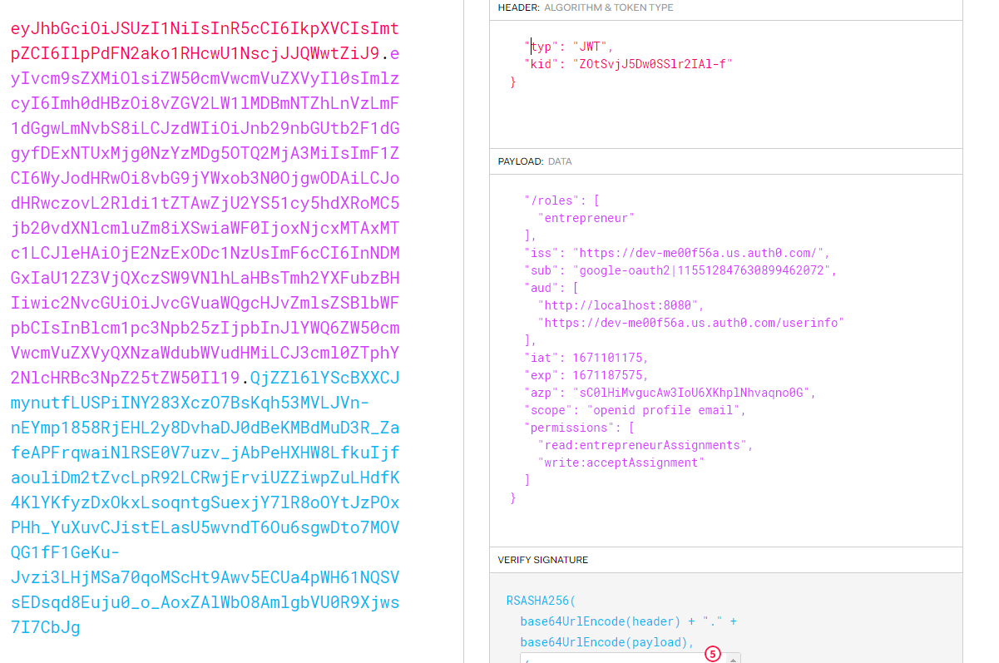

# Onderzoek security
### Op welke plek kun je in een gedistribueerde webapplicatie het veiligst JWT-tokens opslaan?

#### Waarom dit onderzoek?
Ik doe dit onderzoek om de veiligheid van mijn applicatie te waarborgen, en dit aan te kunnen tonen.

#### Onderzoeksmethode
Voor dit onderzoek maak ik gebruik van het DOT-framework. Dit is een gestandaardiseerd research-framework, wat voor kwalitatief onderzoek zorgt.
Onderstaande strategieën binnen het DOT-framework zullen worden toegepast:

**Library**


Ik kies voor de library-strategie om onderzoek te doen naar al bestaande richtlijnen en theorieën.
Dit gezien er een grote hoeveelheid informatie beschikbaar is over het onderzoeksonderwerp.

**Lab** 


Om concepten te kunnen testen en valideren gebruik ik de lab-strategie. Zo kan achterhaald worden of iets werkt zoals verwacht.


# Deelvragen

### Wat is een JWT-token?

Een JSON Web Token (JWT) is een token die versleutelde JSON-data bevat. Het zorgt voor een manier om JSON-data op een veilige manier te versturen.
Ze worden gebruikt voor authenticatie en authorisatie van gebruikers.

Een JWT-token bestaat uit:

- Header

Hierin word het type key omschreven (JWT) en het hashing algoritme, zoals RSA.

- Payload

Hierin staan waardes zoals permissies en rollen omschreven. De namen van de claims mogen maximaal 3 karakters bevatten om de JWT compact te houden.

- Signature

De JWT word ondertekend om te bevestigen dat de persoon is wie hij zegt dat hij is, en om te bevestigen of de inhoud niet aangepast is.

In onderstaande afbeelding is een JWT uit mijn applicatie zichtbaar. De rode kleur bevat de header, de paarse kleur de payload en de blauwe kleur de signature.



### Wat zijn de mogelijke aanvalsmogelijkheden?
**Access token wordt gestolen**

Wanneer de gebruiker zijn JWT-token aan iemand anders doorgeeft, kan diegene verzoeken doen namens de daadwerkelijke persoon.

**CSRF-aanvallen**

Een CSRF aanval is een aanval waarbij een ingelogde gebruiker, zonder dat deze het weet, ongewenste requests uitvoert.
Een voorbeeld hiervan is het verwijderen van een post: op het moment dat er via bijvoorbeeld social engineering een link gestuurd zou worden welke deze request uitvoert, word de post verwijderd zonder dat de gebruiker het weet. (Cross Site Request Forgery (CSRF) | OWASP Foundation, z.d.) [2]

**XSS-aanvallen**

XSS (cross-site-scripting) attacks vinden plaats wanneer er onjuiste data verzonden word, en deze alsnog uitgevoerd word (Cross Site Scripting (XSS) | OWASP Foundation, z.d.) [1].
Deze data kan verzonden worden via bijvoorbeeld een formulier:

````
<SCRIPT type="text/javascript">
var adr = '../evil.php?cakemonster=' + escape(document.cookie);
</SCRIPT>
`````

Wanneer deze data niet gevalideerd zou worden, zou de cookie van een andere gebruiker gebruikt kunnen worden (Cross Site Scripting (XSS) | OWASP Foundation, z.d.) [1].

### Is mijn applicatie kwetsbaar voor een van de aanvallen?
- CSRF

De applicatie is niet kwetsbaar voor CSRF-aanvallen. Dit omdat de API middels [CORS](https://developer.mozilla.org/en-US/docs/Web/HTTP/CORS) alleen verzoeken toestaat vanuit betrouwbare bronnen. Op dit moment mag alleen het IP-adres van de front-end request naar de API maken.
Dit betekend dat een andere applicatie geen requests naar de API kan maken.

- XSS

In de front-end van de applicatie heb ik geen mogelijkheid kunnen vinden voor het uitvoeren van een XSS-aanval. 
Mocht dit wel geprobeerd worden vangt de back-end (API) dit af, doordat er altijd gevalideerd word of de data overeenkomt met hetgeen dat verwacht word.

### Waar kan de JWT-token het veiligst opgeslagen worden?
De JWT-token wordt doorgaans opgeslagen in de localstorage, in een cookie, in een session of in-memory: allemaal client-side.
Om de afweging te maken waar de token op te slaan speelt ook de balans tussen user experience en veiligheid een rol. Zo kan de token in de session storage worden opgeslagen, echter dient de gebruiker dan bij ieder bezoek van de applicatie opnieuw in te loggen.

Zowel bij het opslaan in de localstorage, in-memory of in de cookies is de JWT-token op te halen gezien deze hoe dan ook op de client-side staat.
Dit is echter niet direct een probleem als de applicatie beveiligd is tegen XSS en CSRF aanvallen. Wanneer de applicatie hier niet tegen beschermd is, ontstaan er wel problemen. Deze problemen beperken zich echter niet alleen tot de JWT-tokens, maar betreffen de gehele applicatie.

### Conclusie
Aangezien het op de client-side altijd mogelijk is om bij de JWTs te komen, kies ik ervoor om ze in de localstorage te zetten. Dit is de meest gebruiksvriendelijke manier, en ook op de andere locaties zijn er risico's.
Het blijft wel belangrijk om in de localstorage geen kwetsbare data als wachtwoorden op te slaan. Daarnaast kan er, mocht het mis gaan, slechts voor beperkte tijd misbruik gemaakt worden van de JWT-token aangezien deze slechts 1 uur geldig is. Topt slot dient de applicatie in zijn geheel beveiligd te zijn tegen XSS en CSRF aanvallen.

**Bronnen**

[1] Cross Site Scripting (XSS) | OWASP Foundation. (z.d.). https://owasp.org/www-community/attacks/xss/

[2] Cross Site Request Forgery (CSRF) | OWASP Foundation. (z.d.). https://owasp.org/www-community/attacks/csrf